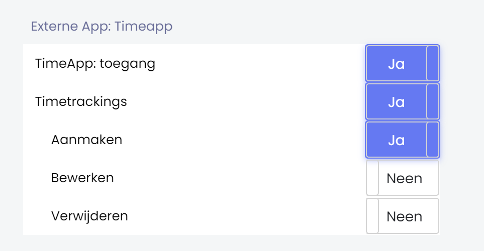
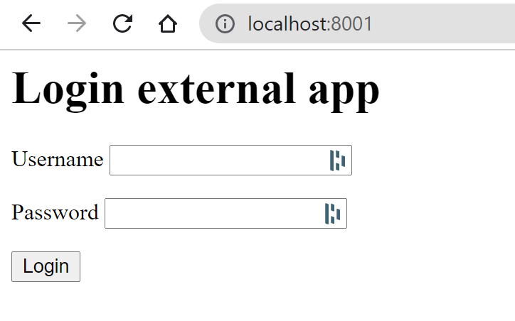
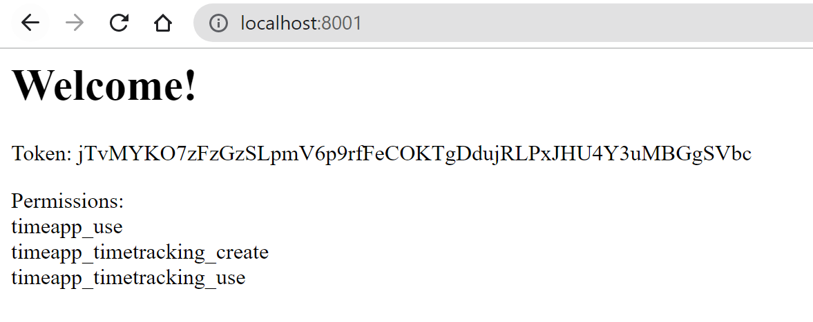
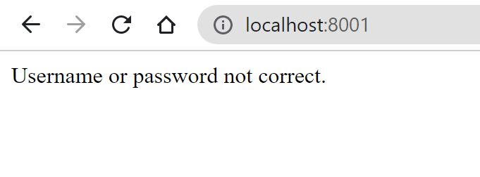

# Cloudspot API wrapper
Basic wrapper for the Cloudspot ERP API.

# Use cases
This wrapper has two use cases:
1. Authenticate and authorize users on an external app, linked to Cloudspot ERP
2. Get data (products, clients,...) from a company that is present on the Cloudspot ERP

# Getting started

### Install

Install with pip.

```python
pip install cloudspot-erp-api
```

### Import

Depending on your use case, you'll need to import either ```CloudspotERP_UserAPI``` or ```CloudspotERP_CompanyAPI```.

```python
# Use case 1
from cloudspot.api import CloudspotERP_UserAPI

# Use case 2
from cloudspot.api import CloudspotERP_CompanyAPI
```

# Functionalities

## CloudspotERP_UserAPI

This class is used to authenticate and authorize a user on an external app.

### Setup

When setting up the class, one paramater is expected: the name/slug of the external application.
This is a crucial and important step. This name/slug is used to determine what application is making the request and what permissions are linked to it.
By using a wrong name/slug, your users will be able to authenticate themselves if their credentials are correct but the permissions will not be mapped correctly. This may lead to giving users too much or too little permissions on the external application.

```python
from cloudspot.api import CloudspotERP_UserAPI
api = CloudspotERP_UserAPI('[NAME_OF_EXTERNAL_APP]')
```

### Authentication and authorization

After setting up the connection, you can use the ```api``` to send request to the Cloudspot ERP.
Users that are trying to log in will give their username and password. Send this username and password to the ERP to validate their credentials.
If correct, the ERP will return a token and the user's permissions for the external application. If not correct, a ```BadCredentials``` error will be raised.

```python
try:
    api.authenticate(username, password)
except BadCredentials as e:
    print(e)
```

If a request is succesful, you can retrieve the returned token and permissions by using ```api.token``` and ```api.permissions``` respectively.

```python
token = api.token
for perm in api.permissions.items():
    print(perm.permission) # Contains the slug of the permission
```

### Basic example

In the below example we'll demonstrate a simple external application where a user can log into.
The credentials of the user will be verified by the ERP and, if succesful, will return a token and the permissions.

This example is written in Django.

#### Login

```html
<!-- login.html -->
<!-- This is the first view that the user will see and use to log in to the application -->
<html>
<head>
    <title>Login</title>
</head>
<body>

    <h1>Login external app</h1>

    <form method="POST">
    

    <p>
        <label>Username</label>
        <input type="text" name="username" />
    </p>

    <p>
        <label>Password</label>
        <input type="password" name="password" />
    </p>

    <p>
        <input type="submit" value="Login" />
    </p>

</form>
</body>
</html>
```

#### Dashboard

```html
<!-- dashboard.html -->
<!-- This page is shown after the user has succesfully logged in. It will show the returned token and permissions. -->
<html>
<head>
    <title>Login</title>
</head>
<body>

    <h1>Welcome!</h1>

    <p>
        Token: {{ token }}
    </p>
    
    <p>
        Permissions:<br>

        
            {{ perm }} <br>
        
    </p>
</body>
</html>
```

#### View

```python
from django.http import HttpResponse
from django.shortcuts import render

from django.views import View

from cloudspot.api import CloudspotERP_UserAPI
from cloudspot.constants.errors import BadCredentials

class LoginView(View):
    template_name = 'login.html'
    
    def get(self, request, *args, **kwargs):
        return render(request, self.template_name)
    
    def post(self, request, *args, **kwargs):
        username = request.POST.get('username', None)
        password = request.POST.get('password', None)
        
        api = CloudspotERP_UserAPI('timeapp')
        
        try:
            api.authenticate(username, password)
        except BadCredentials as e:
            return HttpResponse(e)
        
        data = { 'token' : api.token }
        
        perms = []
        for perm in api.permissions.items():
            perms.append(perm.permission)
            
        data['perms'] = perms
        
        return render(request, 'dashboard.html', data)
```

#### Testing the example

We have created a user in the ERP with the following permissions:



We go to our external application and log in:



If our credentials are correct, we go to the dashboard and see our token and permissions:



If our credentials are incorrect, we get the following message:

